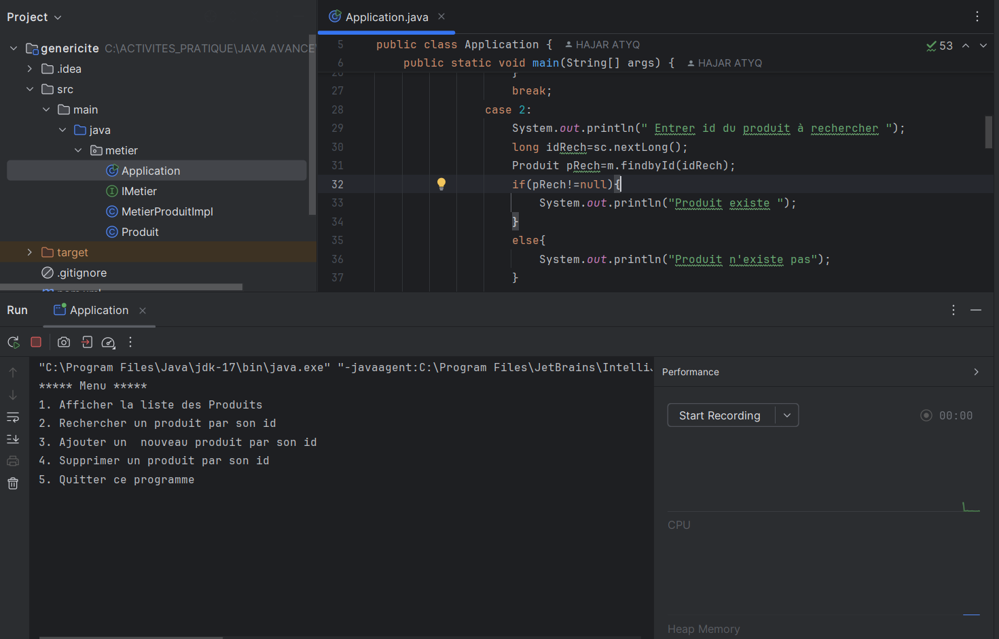
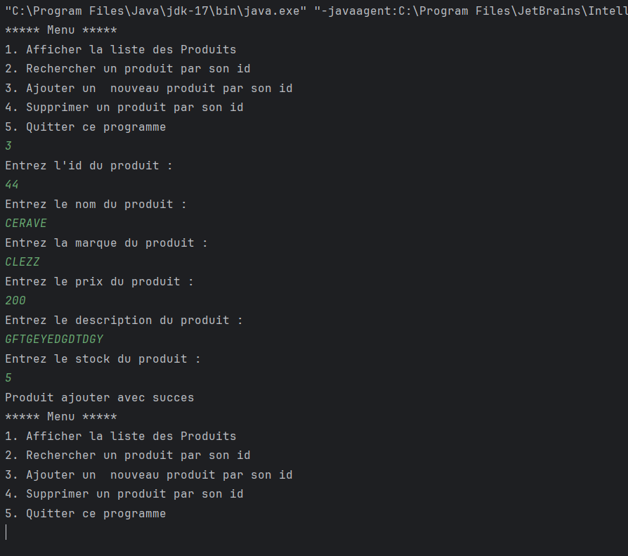

# GenericRepositoryApp 
Une application démontrant l'utilisation d'interfaces génériques pour une gestion flexible et sécurisée des données.
---



## 🚀 Fonctionnalités
- Gestion de données via des interfaces génériques.
- Implémentation multi-langages 
- Sécurité des types grâce aux interfaces génériques.
- Structure extensible et réutilisable.

---

## 📂 Structure du projet
- `src/` : Contient les fichiers sources de l'application.
- `docs/` : Documentation détaillée (facultatif).
- `tests/` : Tests unitaires pour valider les fonctionnalités.
- `README.md` : Documentation principale (vous y êtes !).

---

## 🛠️ Langages et outils utilisés
- **Langages** :
    - Java
   
- **Outils** :
    - IDE (intellij)
    - Git et GitHub pour le versionnement du code.

---

## 📖 Installation et utilisation

### 1. Clonez le projet
```bash
git clone https://github.com/username/NomDuProjet.git
cd NomDuProjet
